# despr2_2_nginx
> Repositorio para desplegar una página con Nginx

## Tarea paso a paso
1. Creación de la Vm
    - Crear un clon de la mv
    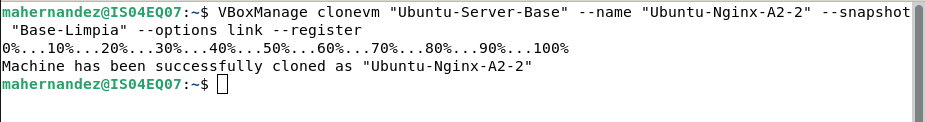
    - Configuración la red
    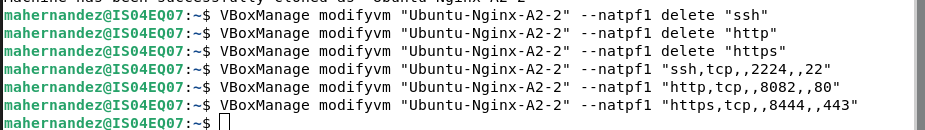
    -inicio de la mv y acceso por ssh al host
    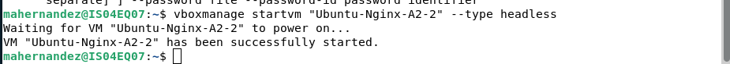
    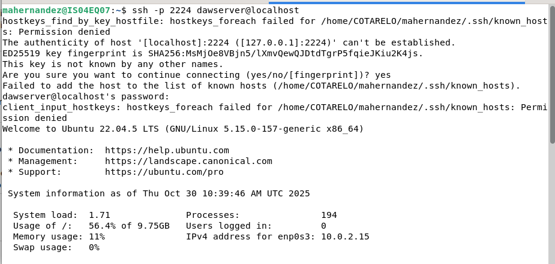

2. Preparación del entorno
    - Arrancar vm y actualización de paquetes
    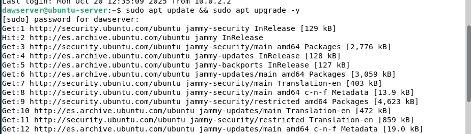
    - Intalación Nginx
    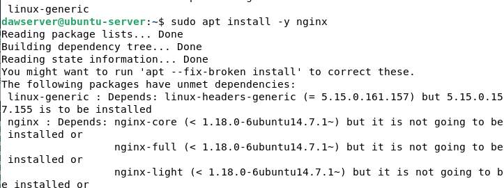
    - Configuración del firewall para permitir tráfico HTTP y HTTPS:
    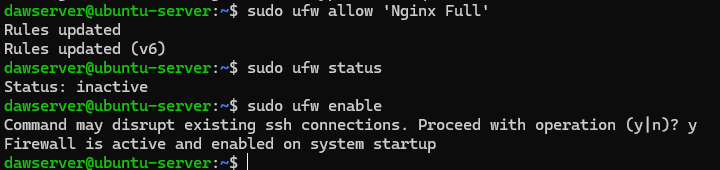

3.Comprobación básica:
    + Comprobación que el servicio está activo:
    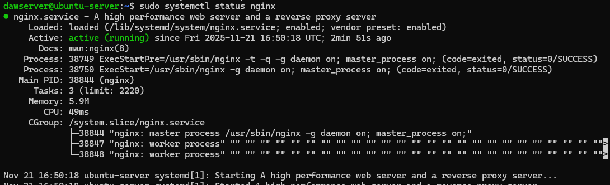
    + Visualización de http://localhost:8082/
    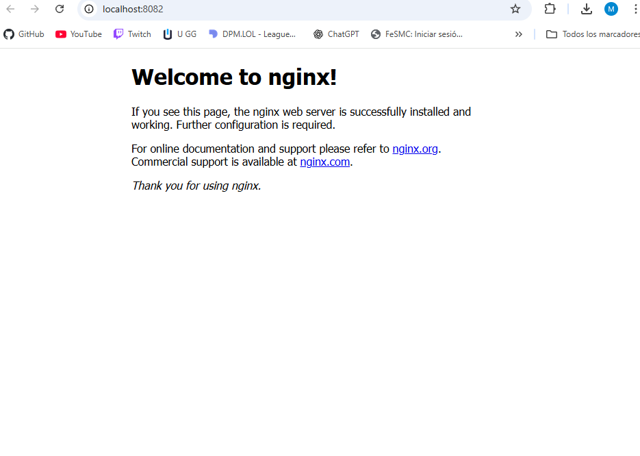
    
4. Desplegación del sitio de ejemplo:
    + Copiar archivos: 
    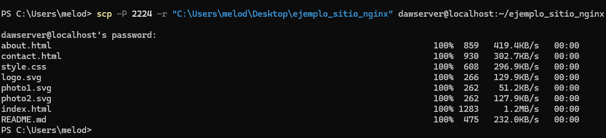

5. Configurar bloque de servidor: 
    + Creación de la configuración:
    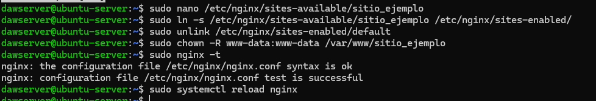
    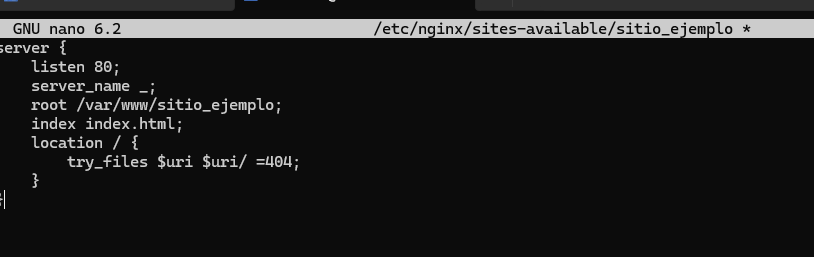

6. Verificación final: 
    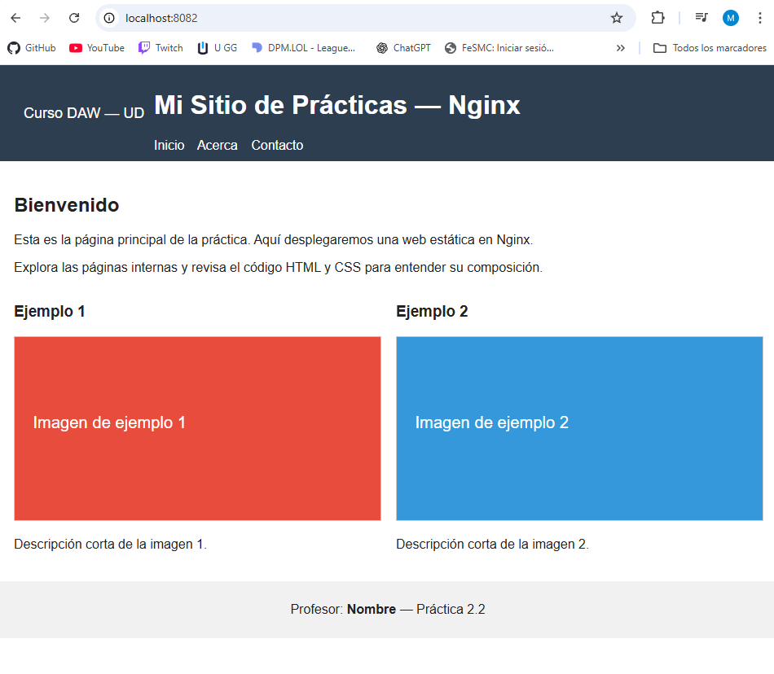

## Problemas encontrados 
En esta tarea tuve varios problemas en el paso 4 (no estaban dentro del apartado de troubleshooting), ya que el ssh no me estaba funcionando y a priori todo lo tenía bien configurado (aunque creo que el error venía por aquí), traté de seguir la actividad desde la propia máquina virtual pero me seguía dando bastantes errores. Lo solucioné borrando la mv y volviendo a empezar ya que las opciones que encontraba en internet me estaban dando todavía más fallos. 
